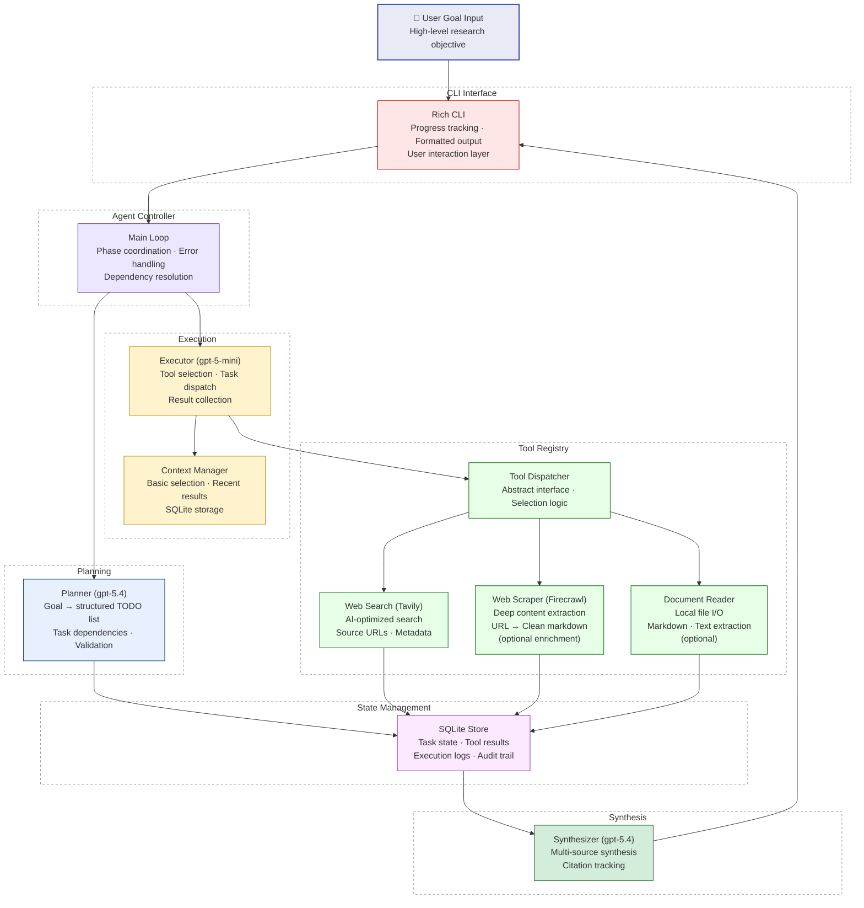

# AI Agent System - Implementation Plan

## Context

This is a take-home case study for an AI Engineering position at Wolters Kluwer. The challenge is to build a small AI agent that helps users tackle complex goals by breaking them into actionable steps and executing them.

**Problem Statement:**
Users have complex goals that require multiple steps to accomplish. They need an AI system that can:
- Understand high-level goals
- Break them down into structured, actionable tasks
- Execute those tasks using real tools
- Provide transparent logging of the process
- Synthesize results into useful outputs

**Key Constraints:**
- Time frame: 4-6 hours recommended
- NO agent frameworks (LangChain, LangGraph, AutoGen, CrewAI, etc.)
- Must implement custom agent loop, prompts, and context handling
- Must integrate at least one real external or local tool

**Evaluation Criteria:**
- Context & Prompt Engineering (35%)
- Agent Loop & Tool Use (45%)
- Evaluation & Communication (20%)

**Architecture Reference:**
The provided diagram shows the intended flow:
```
User Input → Planning Agent → TODO List → Execution Agent (with Tools) → Logs → User Output
```

---

## Original Case Gate

`docs/wolters_kluwer_case.md` is the source of truth for scope and acceptance. The implementation is allowed to add polish only after these gates are satisfied by working code, real logs, and submission artifacts.

| Case Requirement | Plan Commitment | Acceptance Gate |
|------------------|-----------------|-----------------|
| Build a small AI agent for complex goals | Focus on a technical research assistant | One CLI command accepts a high-level research goal and returns a final synthesized result |
| User goal → TODO plan → execute with tools → result | Planner, executor loop, tool registry, synthesizer | A real transcript shows goal input, generated TODOs, task status updates, tool calls, logs, and final output |
| No agent frameworks | Custom Python controller, prompts, context handling, and tool dispatch | Dependency list and code contain no LangChain, LangGraph, AutoGen, CrewAI, or equivalent agent framework |
| Planning minimum requirement | Structured task plan from user goal | Planner produces validated tasks with IDs, descriptions, status, and dependencies |
| Execution loop minimum requirement | Sequential task loop with dependency resolution | Loop selects the next task, executes it, updates status, and continues until completion or a reported failure |
| Tool use minimum requirement | Tavily web search (required) + Firecrawl scraper (optional enrichment) | At least one task uses Tavily against a live query and records source URLs. Firecrawl may be used for deep content extraction if time permits. |
| Context strategy minimum requirement | Basic context selection plus stored tool results | README explains what context is kept (goal, plan, recent results), what is stored in SQLite, and basic selection strategy |
| Evaluation and communication | README, evaluation scenarios, transcript, demo video | Submission includes run instructions, 3-5 scenarios with success criteria, a real transcript, and a 3-5 minute demo video |
| Keep scope small and focused | Bonus features are gated behind the core loop | SQLite resume, document reader, code execution, UI, and advanced tracing do not block the minimum working demo |

**Scope Rule:** If time is constrained, protect the case flow first: `goal → structured plan → one real tool → transparent logs → final result → README/transcript/demo`. Any feature that does not strengthen that path is deferred.

---

## Implemented Outcome Amendment

This document started as the initial delivery plan. The shipped repository is intentionally narrower in a few places so the final submission stays aligned with the case brief's "small and focused" requirement.

**Delivered scope in the repo:**
- **Tool path:** Tavily is the only shipped real tool in the core execution path.
- **Model configuration:** Planning and synthesis use the current `OPENAI_MODEL` setting, with `gpt-5.1` as the default fallback in code.
- **Execution loop:** Tool dispatch and retry behavior are deterministic Python logic, not an LLM-driven executor.
- **Persistence/resume:** SQLite-backed resume is included and treated as shipped polish because it strengthens the core `goal -> plan -> execute -> log -> result` flow.

**Deferred ideas from the original plan:**
- Firecrawl integration
- Local document reader
- Code execution tool
- Broader multi-tool expansion beyond Tavily

These are intentional deferrals, not missing deliverables. For submission review, treat the repository code and README/docs as the source of truth for what was actually built.

---

## Technology Stack

### Core Technologies

**Language:** Python 3.11+
- Rich ecosystem for AI/LLM work
- Excellent async support for API calls
- Strong typing with type hints
- Fast prototyping capabilities

**LLM Provider:** OpenAI API
- **gpt-5.4** for planning and synthesis (most capable)
- **gpt-5-mini** for task execution and tool selection (cost-effective)
- Structured outputs support for reliable JSON parsing
- Function calling for tool integration

**Tools:**
- **Tavily Search API** - AI-optimized web search for research tasks (required real tool)
- **Firecrawl API** - Deep web scraping and content extraction (optional enrichment - only if Tavily is working end-to-end)
- **File Operations** - Optional local document reading if time remains
- **Code Execution** (optional bonus) - Safe Python code execution for calculations only after the core loop works

**State Management:** SQLite
- Lightweight, no external database required
- ACID compliance for reliability
- Easy to inspect and debug
- Stores task state, logs, and tool results for transparent transcripts
- Enables session persistence and resume capability as a bonus, not a blocker

**Supporting Libraries:**
- `openai` - Official OpenAI Python SDK
- `pydantic` - Data validation and structured outputs
- `rich` - Beautiful CLI output and progress tracking
- `python-dotenv` - Environment configuration
- `httpx` - Async HTTP client for tool calls
- `pytest` - Testing framework

**Optional Libraries (install only if implementing):**
- `firecrawl-py` - Firecrawl Python SDK for web scraping (optional enrichment)

---

## Domain Focus: Research Assistant

**Why Research Assistant?**
- Clear success criteria (relevant information found and synthesized)
- Natural fit for web search tool integration
- Demonstrates planning, execution, and synthesis capabilities
- Realistic scope for 4-6 hour timeline
- Easy to evaluate quality of results

**Use Cases:**
- "Research the current state of WebAssembly adoption"
- "Compare GraphQL vs REST APIs for mobile applications"
- "Investigate security best practices for LLM applications"

---

## System Architecture

### Component Overview



### Data Flow

**Phase 1: Planning**
1. User provides high-level goal via CLI
2. Agent Controller invokes Planner with goal
3. Planner (gpt-5.4) generates structured TODO list with dependencies
4. State Manager persists tasks to SQLite
5. CLI displays plan to user for confirmation

**Phase 2: Execution**
1. Agent Controller enters execution loop
2. For each pending task (respecting dependencies):
   - Executor (gpt-5-mini) determines required tool(s)
   - Tool Registry dispatches to appropriate tool
   - Tool executes and returns results
   - State Manager updates task status and stores results
   - Context Manager tracks conversation history
   - CLI displays progress and logs
3. Loop continues until all tasks complete or error

**Phase 3: Synthesis**
1. Agent Controller invokes Synthesizer with all task results
2. Synthesizer (gpt-5.4) creates coherent final report
3. State Manager saves final output
4. CLI displays results to user

---

## Context Management Strategy

### The Challenge
- Research tasks accumulate context: goal + plan + tool results + synthesis
- OpenAI models have token limits (128K for gpt-5.4, 128K for gpt-5-mini)
- Need to maintain coherence while controlling costs
- Long sessions can overflow context window

### Solution: Basic Context Selection + SQLite Storage

**Core Approach:**
Store full tool results in SQLite, only include summaries in LLM prompts. This keeps the minimum case requirement simple while enabling advanced strategies as bonus features.

**What Goes in LLM Context (Minimum):**
- System instructions and role definition
- Original user goal
- Complete task plan structure (task IDs, descriptions, dependencies)
- Current task being executed
- Recent task results (last 3-5 tasks, summarized)

**What Goes in SQLite (Not in LLM Context):**
- Full tool results with metadata
- Complete task execution logs
- All task status transitions
- Detailed error messages and recovery attempts

**Token Budget Monitoring (Bonus):**
- Track tokens per API call using OpenAI's usage data
- Log warnings if approaching limits
- Advanced compression/tiered retention can be added after core loop works

**Implementation Notes:**
- Start with basic selection (goal + plan + current task + recent results)
- SQLite stores full tool results outside LLM context
- Advanced compression/tiered retention are bonus features after core loop works

---

## Implementation Stages

### Stage 1: Foundation & Data Models
**Goal:** Set up project structure and core data models  
**Time Estimate:** 1.25 hours

**Tasks:**
1. Initialize Python project with `pyproject.toml` and dependencies
2. Set up virtual environment and install packages
3. Create `.env.example` with API key placeholders
4. Define Pydantic models for Task, ResearchPlan, AgentSession
5. Implement SQLite schema and State Manager with CRUD operations
6. Create basic CLI scaffold with Rich console
7. Add logging configuration

**Success Criteria:**
- ✅ Can create and persist task plans to SQLite
- ✅ Can query task state correctly (pending, in_progress, completed)
- ✅ CLI accepts input and displays formatted output
- ✅ All models have proper type hints and validation

**Critical Files:**
- `src/models.py` - Pydantic data models
- `src/state.py` - SQLite state management
- `src/cli.py` - Command-line interface
- `pyproject.toml` - Dependencies

**Tests:**
- Create a task plan and verify SQLite persistence
- Query tasks by status
- Update task status and verify changes

**Case Gate:**
- The repo can be installed and run from documented commands
- Task state supports the required transcript: TODOs, status changes, tool calls, and final output
- No agent framework dependency is introduced
- If SQLite setup threatens the timebox, fall back to JSONL session logs and keep SQLite resume as bonus

---

### Stage 2: Planning System
**Goal:** Convert user goals into structured task plans  
**Time Estimate:** 0.75 hours

**Tasks:**
1. Design planning prompt with clear instructions and examples
2. Implement Planner class with OpenAI API integration (gpt-5.4)
3. Use structured outputs to ensure valid JSON task lists
4. Add task dependency validation logic
5. Implement plan review and user confirmation flow
6. Add error handling for malformed plans

**Success Criteria:**
- ✅ Given "Research the impact of AI on healthcare", produces 5-7 specific, actionable tasks
- ✅ Tasks have clear descriptions and realistic dependencies
- ✅ Output is valid JSON matching Task schema
- ✅ Handles edge cases (vague goals, overly broad topics)

**Critical Files:**
- `src/planner.py` - Planning logic
- `src/prompts/planner.txt` - Planning prompt template

**Planning Prompt Structure:**
```
System: You are a research planning assistant...
- Break down goals into 5-7 specific, actionable tasks
- Each task should be completable with available tools
- Specify dependencies between tasks
- Output valid JSON matching schema

User: [goal]
```

**Tests:**
- Test with broad goal: "Research WebAssembly adoption"
- Test with comparative goal: "Compare GraphQL vs REST"
- Test with vague goal: "Learn about AI" (should ask for clarification)

**Case Gate:**
- A high-level user goal becomes a structured TODO list without manual task authoring
- The generated plan is visible to the user before execution
- Each task is executable by the available tool set, especially Tavily search
- Prompt files are committed so reviewers can inspect the planning instructions

---

### Stage 3: Tool System
**Goal:** Implement real tools for task execution  
**Time Estimate:** 1.5 hours

**Tasks:**
1. Create abstract Tool base class with execute() interface
2. Implement Tool Registry with registration and selection logic
3. Build Web Search tool with Tavily API integration (REQUIRED - priority 1)
4. Add error handling, retries, and rate limiting for Tavily
5. Implement tool result formatting and storage
6. Build Web Scraper tool with Firecrawl API integration (OPTIONAL - only if Tavily works end-to-end with 30+ min remaining)
7. Build Document Reader tool for local file operations (OPTIONAL - lowest priority)

**Success Criteria:**
- ✅ Web search returns relevant, recent results for technical queries (Tavily) - REQUIRED
- ✅ Web scraper extracts full article content from URLs (Firecrawl) - OPTIONAL
- ✅ Document reader extracts content from markdown/text files - OPTIONAL
- ✅ Tools handle errors gracefully (API failures, rate limits, invalid inputs)
- ✅ Tool results are properly formatted and stored in SQLite

**Critical Files:**
- `src/tools/base.py` - Abstract Tool interface
- `src/tools/registry.py` - Tool registration and selection
- `src/tools/web_search.py` - Tavily integration (REQUIRED)
- `src/tools/web_scraper.py` - Firecrawl integration (OPTIONAL)
- `src/tools/document_reader.py` - File I/O operations (OPTIONAL)

**Tool Interface:**
```python
class Tool(ABC):
    @abstractmethod
    async def execute(self, task: Task, context: dict) -> ToolResult:
        pass
    
    @abstractmethod
    def can_handle(self, task: Task) -> bool:
        pass
```

**Tests:**
- Search for "Python async best practices" and verify results (Tavily) - REQUIRED
- Scrape a technical article URL and verify clean markdown output (Firecrawl) - OPTIONAL
- Read a local markdown file and extract content (Document Reader) - OPTIONAL
- Test error handling with invalid API key
- Test rate limiting with rapid successive calls

**Case Gate:**
- Tavily web search executes during the demo path with live API calls
- Tool calls are logged with task ID, input/query, status, summary, and source metadata
- The final transcript must use live Tavily output, not mocked success data
- Firecrawl is added only if Tavily is working end-to-end with 30+ minutes remaining in Stage 3
- Optional tools are deferred unless they improve the required demo without risking completion

---

### Stage 4: Agent Loop & Execution
**Goal:** Orchestrate planning, execution, and synthesis  
**Time Estimate:** 1.25 hours

**Tasks:**
1. Implement main Agent Controller with run_agent_loop()
2. Build Executor class with tool dispatch logic (gpt-5-mini)
3. Implement task selection with dependency resolution
4. Add basic Context Manager with token tracking
5. Integrate all components into end-to-end flow
6. Add progress tracking and logging with Rich
7. Implement error recovery and retry logic

**Success Criteria:**
- ✅ Complete research task: "Compare Python vs Rust for web development"
- ✅ Executes 5-6 tasks in correct dependency order
- ✅ Produces final synthesized report with citations
- ✅ Handles tool failures gracefully (retries, fallbacks)
- ✅ Context selection keeps relevant information (goal, plan, recent results)
- ✅ Progress is visible in CLI with clear logging

**Critical Files:**
- `src/agent.py` - Main agent controller and loop
- `src/executor.py` - Task execution engine
- `src/context.py` - Basic context selection
- `src/synthesizer.py` - Post-execution synthesis component

**Agent Loop Pseudocode:**
```python
async def run_agent_loop(goal: str):
    # Phase 1: Planning
    plan = await planner.create_plan(goal)
    state.save_plan(plan)
    
    # Phase 2: Execution
    while state.has_pending_tasks():
        task = state.get_next_task()  # Respects dependencies
        
        tool = registry.select_tool(task)
        result = await tool.execute(task)
        
        state.update_task(task.id, status="completed", result=result)
        context.track_interaction(task, result)
    
    # Phase 3: Synthesis
    final_report = await synthesizer.synthesize(state.get_all_results())
    return final_report
```

**Tests:**
- End-to-end test with complete research goal
- Test dependency resolution (task B waits for task A)
- Test error recovery when tool fails

**Case Gate:**
- The agent demonstrates the required loop: select task → execute → update status → log
- The CLI shows transparent progress as tasks move through pending, in_progress, completed, or failed
- Context handling keeps the original goal, task plan, current task, and recent results in prompt context
- Advanced compression and resume behavior are bonus if the simple loop is not yet polished

---

### Stage 5: Evaluation & Documentation
**Goal:** Testing, documentation, and demo preparation  
**Time Estimate:** 1 hour

**Tasks:**
1. Define 3-5 evaluation scenarios with success criteria
2. Run all scenarios and capture transcripts
3. Document results, limitations, and edge cases
4. Write comprehensive README with:
   - Architecture explanation
   - Setup instructions
   - Context management strategy
   - Tool descriptions
   - Evaluation results
5. Create EVALUATION.md with detailed test cases if the README would become too long
6. Record 3-5 minute demo video showing:
   - Complete flow from goal to result
   - How information flows through components
   - Context management in action
   - Future improvements
7. Code cleanup: docstrings, type hints, formatting
8. Final testing and bug fixes

**Success Criteria:**
- ✅ 3-5 evaluation scenarios documented with results
- ✅ README is clear, complete, and easy to follow
- ✅ Demo video covers all required topics
- ✅ Code passes type checking (mypy) and linting (ruff)
- ✅ All tests pass
- ✅ Repository is ready for submission

**Critical Files:**
- `README.md` - Main documentation
- `EVALUATION.md` - Test scenarios and results (optional - can be in README)
- `examples/transcript_*.md` - Example sessions
- `examples/demo_video.mp4` or linked screen recording - Demo artifact

**Case Gate:**
- README explains the agent loop, integrated tools, context strategy, and 3-5 evaluation scenarios with success definitions
- At least one example transcript is captured from a real run: goal → plan → execution → result
- Demo video (3-5 minutes) covers capability, information flow, and future improvements
- README or evaluation notes state time spent and trade-offs made
- Public GitHub repository has clear run instructions and excludes local secrets

---

## Evaluation Scenarios

### Scenario 1: Broad Technical Topic
**Goal:** "Research the current state of WebAssembly adoption"

**Expected Behavior:**
- Planner creates 5-7 tasks covering: definition, use cases, adoption metrics, major implementations, future trends
- Web search finds recent articles (2025-2026)
- Synthesizer creates coherent report with citations

**Success Metrics:**
- ✅ 100% task completion rate
- ✅ 4/5 relevance score (manual evaluation)
- ✅ Context usage < 50K tokens
- ✅ Execution time < 3 minutes
- ✅ All sources from 2024-2026

---

### Scenario 2: Comparative Analysis
**Goal:** "Compare GraphQL vs REST APIs for mobile applications"

**Expected Behavior:**
- Planner identifies key comparison dimensions: performance, developer experience, ecosystem, use cases
- Tasks cover both technologies fairly
- Synthesizer provides balanced comparison with pros/cons

**Success Metrics:**
- ✅ 100% task completion rate
- ✅ Covers at least 4 comparison dimensions
- ✅ Balanced coverage (not biased toward one technology)
- ✅ Context usage < 60K tokens
- ✅ Execution time < 4 minutes

---

### Scenario 3: Emerging Technology
**Goal:** "Investigate recent developments in AI code generation tools"

**Expected Behavior:**
- Planner creates tasks for: current landscape, recent releases, capabilities, limitations, trends
- Web search finds very recent information (2025-2026)
- Synthesizer highlights what's new and emerging

**Success Metrics:**
- ✅ 100% task completion rate
- ✅ All sources from 2025-2026 (no outdated info)
- ✅ Mentions at least 5 different tools
- ✅ Context usage < 55K tokens
- ✅ Execution time < 3 minutes

---

### Scenario 4: Error Recovery
**Goal:** "Research [intentionally obscure topic with limited results]"

**Expected Behavior:**
- Planner creates reasonable tasks despite limited information
- Web search returns few or no results
- Agent handles gracefully: tries alternative queries, reports limitations honestly
- No hallucination of fake information

**Success Metrics:**
- ✅ Graceful degradation (doesn't crash)
- ✅ Clear error messages about limited information
- ✅ No hallucinated facts (manual verification)
- ✅ Suggests alternative approaches or related topics
- ✅ Execution time < 2 minutes

---

### Scenario 5: Complex Multi-Step Research
**Goal:** "Research security implications of using LLMs in production and mitigation best practices"

**Expected Behavior:**
- Planner creates 8-10 tasks covering: threat landscape, specific vulnerabilities, mitigation strategies, tools, case studies
- Tasks have logical dependencies (understand threats before mitigations)
- Synthesizer maintains coherence across many tasks
- Context management handles longer session

**Success Metrics:**
- ✅ 100% task completion rate
- ✅ Logical task ordering respected
- ✅ Final synthesis preserves key findings from earlier tasks using stored results
- ✅ 4/5 synthesis quality score
- ✅ Context usage < 80K tokens
- ✅ Execution time < 5 minutes

---

## File Structure

```
wolters_kluwer_case/
├── README.md                      # Main documentation
├── IMPLEMENTATION_PLAN.md         # This file
├── EVALUATION.md                  # Test scenarios (optional - can be in README)
├── pyproject.toml                 # Project dependencies
├── .env.example                   # Environment template
├── .gitignore
│
├── src/
│   ├── __init__.py
│   ├── agent.py                   # Main agent controller
│   ├── planner.py                 # Goal → task plan (gpt-5.4)
│   ├── executor.py                # Task execution (gpt-5-mini)
│   ├── synthesizer.py             # Post-execution synthesis (gpt-5.4)
│   ├── state.py                   # SQLite state management
│   ├── context.py                 # Basic context selection
│   ├── models.py                  # Pydantic data models
│   ├── cli.py                     # Command-line interface
│   │
│   ├── tools/
│   │   ├── __init__.py
│   │   ├── base.py                # Abstract tool interface
│   │   ├── registry.py            # Tool discovery and selection
│   │   ├── web_search.py          # Tavily integration
│   │   ├── web_scraper.py         # Firecrawl integration (optional)
│   │   └── document_reader.py     # File I/O operations (optional)
│   │
│   └── prompts/
│       ├── system.txt             # Base system prompt
│       ├── planner.txt            # Planning instructions
│       ├── executor.txt           # Execution instructions
│       └── synthesizer.txt        # Synthesis instructions
│
├── tests/
│   ├── __init__.py
│   ├── test_models.py             # Data model tests
│   ├── test_state.py              # State management tests
│   ├── test_planner.py            # Planning tests
│   ├── test_tools.py              # Tool tests
│   └── test_agent.py              # Integration tests
│
├── examples/
│   ├── transcript_scenario1.md    # Example session 1
│   ├── transcript_scenario2.md    # Example session 2
│   ├── transcript_scenario5.md    # Complex example
│   └── demo_video.mp4             # Screen recording
│
├── data/
│   └── sessions.db                # SQLite database (gitignored)
│
└── docs/
    └── wolters_kluwer_case.md     # Original requirements
```

---

## Key Design Decisions & Trade-offs

### 1. OpenAI API with Model Splitting
**Decision:** Use gpt-5.4 for planning/synthesis, gpt-5-mini for execution

**Rationale:**
- Planning requires strong reasoning → gpt-5.4
- Task execution is more straightforward → gpt-5-mini saves cost
- Synthesis needs coherence → gpt-5.4
- Estimated cost savings: 60-70% vs using gpt-5.4 for everything

**Trade-off:** Slightly more complex code (two model configurations), but significant cost savings and appropriate capability matching

---

### 2. Domain: Research Assistant
**Decision:** Focus on technical research tasks

**Rationale:**
- Clear success criteria (relevant information found)
- Natural fit for web search tool
- Demonstrates all required capabilities
- Realistic scope for timeline
- Easy to evaluate objectively

**Trade-off:** Less novel than some domains, but execution quality matters more than novelty for this evaluation

---

### 3. Synchronous Task Execution
**Decision:** Execute tasks sequentially, not in parallel

**Rationale:**
- Simpler to implement and debug
- Easier to maintain context coherence
- Respects task dependencies naturally
- More transparent logging
- Can add parallelization later if needed

**Trade-off:** Slower than parallel execution, but more predictable and easier to understand

---

### 4. Context Strategy: Basic Selection + Structured State
**Decision:** Simple approach with recent context and SQLite storage

**Rationale:**
- Keep recent task results in context for immediate use
- SQLite stores full execution history outside LLM context
- Synthesizer reads from SQLite for final report generation
- Straightforward implementation within time constraints

**Trade-off:** Less sophisticated than compression-based approaches, but sufficient for research tasks and easier to implement correctly

---

### 5. Tool Selection: Tavily over Raw Scraping
**Decision:** Use Tavily Search API instead of BeautifulSoup/Selenium

**Rationale:**
- Returns clean, AI-ready content
- Handles rate limiting and errors
- More reliable than scraping
- Faster development
- Better results for research tasks

**Trade-off:** External dependency and API costs, but worth it for quality and development speed

---

### 6. State Persistence: SQLite
**Decision:** SQLite for task state, not in-memory

**Rationale:**
- Enables resume capability (bonus feature)
- Easy to inspect and debug
- No external database setup
- ACID guarantees
- Demonstrates production-ready thinking

**Trade-off:** Slight complexity overhead, but enables valuable features

---

### 7. CLI with Rich
**Decision:** Terminal-based interface with rich formatting

**Rationale:**
- Fastest to implement (fits timeline)
- Excellent UX with colors, progress bars, tables
- Great for demos and screenshots
- Professional appearance
- No frontend complexity

**Trade-off:** Not as polished as web UI, but sufficient for evaluation and actually preferred by many developers

---

### 8. Error Handling: Fail-Soft with Logging
**Decision:** Log errors, mark tasks as failed, continue with other tasks

**Rationale:**
- Partial results better than complete failure
- Transparent about limitations
- Demonstrates robustness
- Real-world systems need graceful degradation

**Trade-off:** May produce incomplete reports, but honest about capabilities

---

## Risk Mitigation

### Technical Risks

**API Rate Limits**
- Mitigation: Exponential backoff with retries
- Mitigation: Rate limiting in tool layer
- Mitigation: Graceful degradation if limits hit

**Context Overflow**
- Mitigation: Store full results in SQLite (not in LLM context)
- Mitigation: Monitor token usage per request
- Mitigation: Keep only recent results in prompts
- Mitigation: Advanced compression can be added as bonus if needed

**Tool Failures**
- Mitigation: Try-catch with specific error handling
- Mitigation: Retry logic with exponential backoff
- Mitigation: Fallback strategies (alternative queries)
- Mitigation: Clear error messages to user

**Malformed LLM Outputs**
- Mitigation: Use OpenAI structured outputs for JSON
- Mitigation: Pydantic validation on all data models
- Mitigation: Fallback parsing strategies
- Mitigation: Clear error messages and retry

### Scope Risks

**Feature Creep**
- Mitigation: Stick to minimum requirements first
- Mitigation: Mark bonus features clearly
- Mitigation: Time-box each stage

**Over-Engineering**
- Mitigation: Simple solutions first
- Mitigation: Refactor only if needed
- Mitigation: Focus on working code over perfect code

**Time Overrun**
- Mitigation: Prioritize core loop over polish
- Mitigation: Cut bonus features if needed
- Mitigation: 15-minute buffer in timeline

---

## Timeline & Milestones

**Total Time Budget: 6 hours**

| Stage | Duration | Cumulative | Key Deliverable |
|-------|----------|------------|-----------------|
| Stage 1: Foundation | 1.25 hours | 1.25h | Working data models, state/log storage, CLI scaffold |
| Stage 2: Planning | 0.75 hours | 2.0h | Goal → structured task plan |
| Stage 3: Tools | 1.5 hours | 3.5h | Tavily search working with logged results (Firecrawl if time permits) |
| Stage 4: Agent Loop | 1.25 hours | 4.75h | End-to-end execution |
| Stage 5: Evaluation | 1.0 hour | 5.75h | README, transcript, evaluation notes, demo prep |
| **Buffer** | 0.25 hours | 6.0h | Unexpected issues or bonus polish |

**Checkpoints:**
- ✅ After Stage 1: Can persist and query tasks
- ✅ After Stage 2: Can generate valid plans
- ✅ After Stage 3: Tools return real results
- ✅ After Stage 4: Complete end-to-end flow works
- ✅ After Stage 5: Ready for submission

---

## Verification Strategy

### Unit Tests
- Data model validation (Pydantic)
- State management CRUD operations
- Tool execution with mocked APIs
- Context selection logic

### Integration Tests
- End-to-end agent loop
- Planning → execution → synthesis flow
- Error recovery scenarios
- SQLite storage and retrieval

### Manual Testing
- Run 3-5 evaluation scenarios
- Verify output quality manually
- Check for hallucinations
- Test edge cases (vague goals, errors, etc.)

### Code Quality
- Type checking with mypy
- Linting with ruff
- Format with black
- Docstrings for all public functions

---

## Future Improvements (Out of Scope)

These are explicitly out of scope for the 4-6 hour timeline but worth mentioning:

1. **Parallel Task Execution** - Execute independent tasks concurrently
2. **Web UI** - React/Streamlit interface for better UX
3. **RAG Integration** - Vector search over document collections
4. **Multi-Agent Collaboration** - Specialized agents for different task types
5. **Human-in-the-Loop** - User approval before executing tasks
6. **Advanced Tool Integration** - Code execution, database queries, API calls
7. **Streaming Responses** - Real-time output as tasks complete
8. **Cost Tracking** - Monitor API costs per session
9. **A/B Testing** - Compare different planning strategies
10. **Production Deployment** - Docker, API server, authentication

---

## Success Criteria Summary

**Minimum Requirements (Must Have):**
- ✅ Planning: Generate structured plan from user goal
- ✅ Execution Loop: Iterate through tasks with dependency resolution
- ✅ Tool Use: At least one real external tool (Tavily web search)
- ✅ Context Strategy: Documented and implemented basic selection with SQLite storage

**Evaluation Criteria (Must Demonstrate):**
- ✅ Context & Prompt Engineering (35%): Clear prompts, context management, structured outputs
- ✅ Agent Loop & Tool Use (45%): Working loop, tool integration, transparent logging
- ✅ Evaluation & Communication (20%): 3-5 scenarios, clear README, transcript, demo

**Deliverables (Must Submit):**
- ✅ Source code in public Git repository
- ✅ README with architecture, tools, context strategy, evaluation
- ✅ Example transcript from a real run
- ✅ Demo video (3-5 minutes)

**Bonus Features (Nice to Have):**
- ⬜ Session persistence and resume capability (SQLite enables this)
- ⬜ Rich CLI with progress tracking (planned)
- ⬜ Structured logging (planned)
- ⬜ Minimal UI (out of scope for timeline)
- ⬜ RAG over documents (out of scope for timeline)

---

## Notes

**Time Spent:** This plan took approximately 30 minutes to create

**Trade-offs Made:**
- Chose research assistant over more novel domains (faster to implement, clearer evaluation)
- Sequential execution over parallel (simpler, more transparent)
- CLI over web UI (faster development, still professional)
- Tavily over raw scraping (better results, faster development)

**Key Insights:**
- The 45% weight on agent loop & tool use suggests this is the most important area
- Context management (35%) is critical - need to demonstrate thoughtful approach
- Evaluation (20%) requires clear scenarios and honest assessment
- No frameworks means showing understanding of fundamentals

**Questions for Clarification:**
- None at this time - requirements are clear

**Ready to Implement:** Yes, this plan provides clear stages, success criteria, and verification steps for each component.
