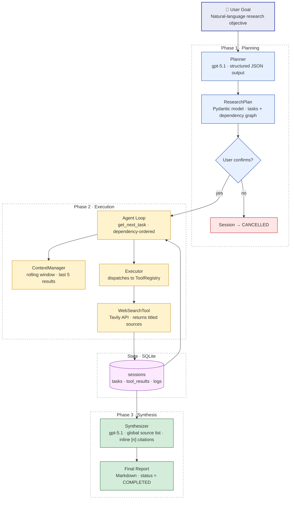
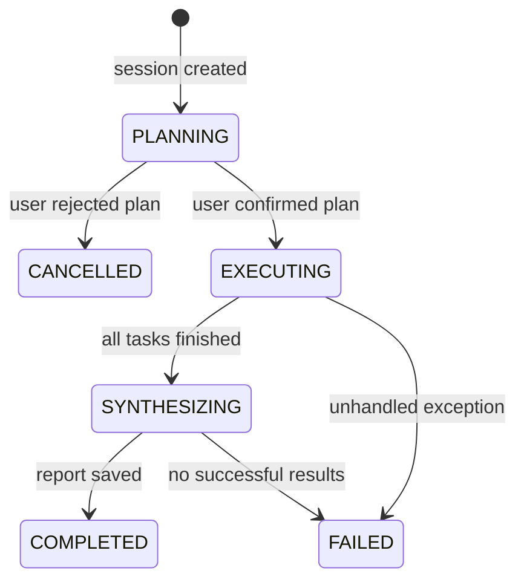
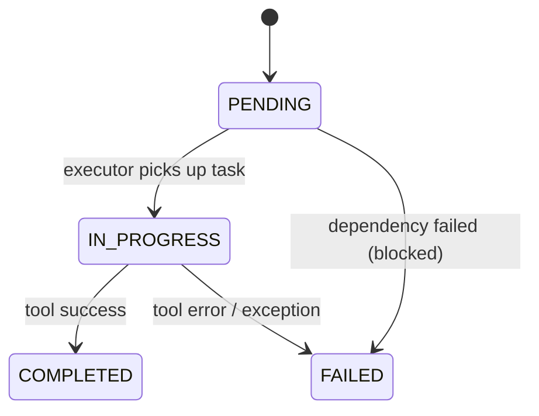

# Research Agent — Architecture

**Version:** 1.0.0
**Date:** 2026-05-08
**Audience:** Technical reviewers, future contributors

---

## 1. Purpose

This system is a minimal, framework-free async research agent. Given a natural-language goal
it generates a dependency-aware task plan, executes each task against real tools, and
synthesises a cited Markdown report. All state is persisted in SQLite so sessions can be
listed and resumed after interruption.

The design priority is legibility: every component has a single clear responsibility, there are
no implicit side effects between components, and all persistence is in a human-inspectable
local database.

---

## 2. Core Design Principle: Agent Orchestrates, Tools Execute



The LLM is used in exactly two places:

- **Planner** — generates the task list and dependency graph from the goal.
- **Synthesizer** — produces the final report from tool outputs.

It is not used to decide which tool to call, to validate results, or to interpret errors.
Those paths are deterministic Python.

---

## 3. Component Map

```
wolters_kluwer_case/
├── main.py                 CLI entry point; --list-sessions, --resume, positional goal
├── src/
│   ├── agent.py            Agent controller: run() and resume() orchestration loops
│   ├── planner.py          AsyncOpenAI call → ResearchPlan (structured output)
│   ├── synthesizer.py      AsyncOpenAI call → cited Markdown report
│   ├── executor.py         Task dispatch via ToolRegistry; status transitions
│   ├── context.py          Rolling-window context builder (last N results)
│   ├── state.py            SQLite persistence: sessions, tasks, tool_results, logs
│   ├── cli.py              Rich terminal UI (display, prompts, progress)
│   ├── models.py           Pydantic models + SessionStatus/TaskStatus enums
│   ├── tools/
│   │   ├── base.py         Abstract Tool ABC (name, description, can_handle, execute)
│   │   ├── registry.py     ToolRegistry: register/dispatch by name
│   │   └── web_search.py   WebSearchTool: Tavily API wrapper
│   └── prompts/
│       ├── planner.txt     Planning system prompt
│       └── synthesizer.txt Synthesis system prompt (instructs inline citations)
├── tests/                  pytest suite — 51 tests
├── data/                   SQLite database (created at first run)
└── examples/               Annotated run transcripts
```

---

## 4. Data Models

All models are Pydantic v2. The enums prevent magic-string bugs across the codebase.

| Model | Purpose | Key fields |
|---|---|---|
| `Task` | A single unit of work | `id`, `description`, `status: TaskStatus`, `dependencies: list[str]` |
| `ResearchPlan` | LLM-generated plan | `goal`, `tasks: list[Task]` |
| `ToolResult` | Tool execution output | `task_id`, `success`, `summary`, `full_content`, `metadata` |
| `AgentSession` | Full session record | `session_id`, `goal`, `plan`, `final_report`, `status: SessionStatus` |
| `LogEntry` | Structured audit log | `level: Literal["INFO","WARNING","ERROR"]`, `component`, `message` |

**`SessionStatus` lifecycle:**



**`TaskStatus` lifecycle:**



---

## 5. Persistence Schema

Four SQLite tables in `data/sessions.db`:

```
sessions
  session_id TEXT PK
  goal, plan_json, final_report, status, created_at, completed_at

tasks
  (session_id, id)  COMPOSITE PK
  description, status, dependencies_json, tool_name, result, error
  FK → sessions(session_id)

tool_results
  id INTEGER PK AUTOINCREMENT
  tool_name, task_id, session_id, success, summary, full_content, metadata_json
  FK → tasks(session_id, id)
  FK → sessions(session_id)

logs
  id INTEGER PK AUTOINCREMENT
  session_id, timestamp, level, component, message, metadata_json
  FK → sessions(session_id)
```

The composite primary key on `tasks` (`session_id`, `id`) is required because task IDs are
only unique within a session. `tool_results` references both columns to maintain referential
integrity.

---

## 6. Execution Order and Dependency Resolution

`StateManager.get_next_task()` scans tasks in insertion order and returns the first
`PENDING` task whose every dependency `task_id` has `status == COMPLETED`. Tasks with
unmet dependencies are skipped in the current pass.

If `get_next_task()` returns `None` while `has_pending_tasks()` is still true, remaining
pending tasks have failed dependencies. They are force-failed with
`error="Blocked by failed dependencies"` and the loop terminates.

This is a simple topological walk, not a full DAG scheduler. It is deliberately serial:
the context window is small and tasks frequently depend on prior results.

---

## 7. Context Window Strategy

`ContextManager` keeps a rolling window of the last `max_recent_results` (default 5)
tool results. For each new task it builds a `dict` containing:

- the overall goal
- the current task descriptor
- a status summary of all tasks in the plan
- summaries of the N most recent results

This context is passed to `Executor.execute_task()` and forwarded to the tool. For
`WebSearchTool` the context informs query refinement. The window prevents token
growth proportional to session length while preserving the most relevant recent
findings.

---

## 8. Source Attribution

The synthesizer prompt instructs the LLM to use inline `[n]` citations and append a
`## Sources` section. The source list is built deterministically in
`Synthesizer._build_context()`:

1. Iterate all `ToolResult.metadata["sources"]` entries.
2. Deduplicate by URL.
3. Emit a numbered list `[1] Title — URL` before the synthesis instructions.

`metadata["sources"]` may contain either `dict` objects (`{"url": …, "title": …}`) or
plain URL strings. Both are handled.

---

## 9. Session Resume

`Agent.resume(session_id)`:

1. Loads the existing session. Raises `ValueError` if the session:
   - does not exist,
   - is `COMPLETED` (`"already completed"`), or
   - is `CANCELLED` or `PLANNING` (`"cannot be resumed"` — plan was never approved
     for execution, so running it silently would execute user-rejected tasks).
2. Resets any `IN_PROGRESS` **or `FAILED`** tasks to `PENDING`. `FAILED` tasks are
   reset because the primary resume use-case is transient network/API failure; without
   this reset, `--resume` would be a no-op for the most common failure mode.
3. Re-enters Phase 2 (execution loop) and Phase 3 (synthesis), reusing all `COMPLETED`
   task results already in `tool_results`.

This allows recovery from network failures, API rate limits, or manual interruption
without discarding partial work.

---

## 10. What Was Deliberately Left Out

| Feature | Reason |
|---|---|
| Agent framework (LangChain, LangGraph, etc.) | Adds abstraction without benefit for a single-tool serial loop |
| Parallel task execution | Context window strategy assumes serial, dependency-ordered results |
| Vector store / RAG | Not needed; full text is stored in `tool_results.full_content` |
| Streaming output | Terminal UI uses Rich panels; streaming adds complexity for no UX gain |
| Additional tool types | Tavily covers the take-home scope; registry pattern supports future addition |
| Web UI / REST API | Out of scope |

---

## 11. Known Gaps

- **Single tool type:** Only `WebSearchTool` is registered. The `ToolRegistry` and
  `Tool` ABC support additional tools; none are implemented beyond the take-home scope.

- **No parallel execution:** Tasks run serially. High-dependency-count plans with many
  independent branches are slower than necessary.

- **Context cleared on resume:** `ContextManager` is in-memory. On resume the rolling
  window starts empty; the first few tasks after resume have no prior-result context.
  Completed result summaries are not pre-loaded into the window.
