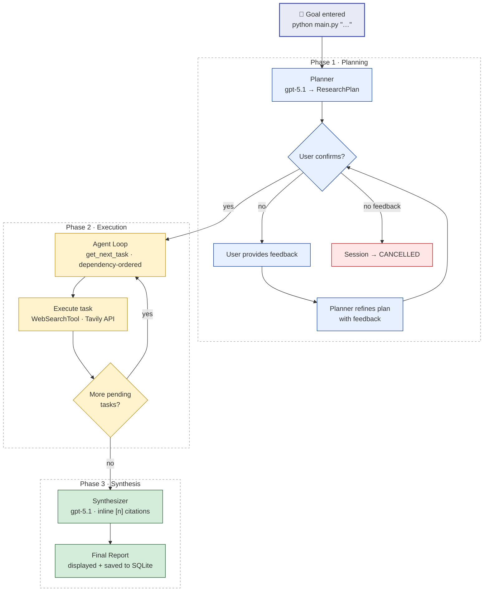
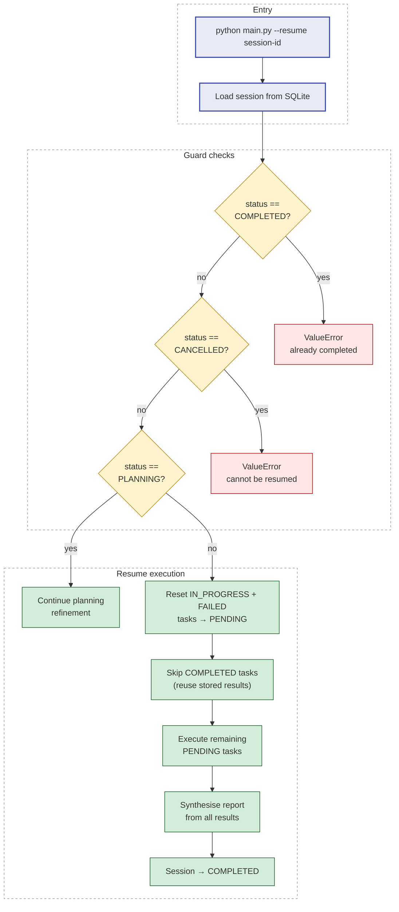

# Research Agent — End-to-End Walkthrough

**Version:** 1.0.0
**Date:** 2026-05-08

This document traces a complete research session from goal entry to final report.
The example topic is **WebAssembly adoption** (see `examples/transcript_webassembly.md`
for the full annotated transcript).



---

## 1. Session Start

The user invokes the agent:

```
python main.py "Research the current state of WebAssembly adoption"
```

`main.py` loads `.env`, instantiates the agent via `create_agent()`, and calls
`Agent.run(goal)`.

`create_agent()` wires the components:

```
StateManager("data/sessions.db")
Planner()
Synthesizer()
ContextManager()
CLI()
ToolRegistry  ←  WebSearchTool registered
Executor(registry, state)
Agent(state, planner, executor, synthesizer, context, cli)
```

A new `AgentSession` is created in SQLite with `status=PLANNING` and a fresh UUID:

```
session_id: abc123-example
goal:       "Research the current state of WebAssembly adoption"
status:     planning
created_at: 2026-05-08T10:00:00Z
```

---

## 2. Phase 1: Planning

`Planner.create_plan(goal)` sends the goal to gpt-5.1 with a structured-output system
prompt. The model returns a JSON array of tasks; Pydantic validates it into a
`ResearchPlan`.

For the WebAssembly goal, the planner produces six tasks:

| ID | Description | Dependencies |
|----|-------------|--------------|
| task-1 | Search for WebAssembly definition and core capabilities | — |
| task-2 | Search for major companies and projects using WebAssembly | — |
| task-3 | Search for WebAssembly adoption statistics and trends | — |
| task-4 | Search for WebAssembly performance benchmarks | — |
| task-5 | Search for WebAssembly ecosystem and tooling | — |
| task-6 | Search for future developments and roadmap | task-1, task-2, task-3 |

Tasks 1–5 have no dependencies and are immediately eligible for execution.
Task 6 depends on tasks 1, 2, and 3 — it will only run after all three complete.

The plan is saved to the `tasks` table and the CLI renders it as a table for user
confirmation:

```
Research Plan
┌──────────┬─────────────────────────────────────────┬──────────────────────┐
│ ID       │ Description                             │ Dependencies         │
├──────────┼─────────────────────────────────────────┼──────────────────────┤
│ task-1   │ WebAssembly definition and capabilities │ none                 │
│ task-6   │ Future developments and roadmap         │ task-1, task-2, ...  │
└──────────┴─────────────────────────────────────────┴──────────────────────┘
Proceed with this plan? [y/n]:
```

### 2.1 Plan Refinement Loop

If the user types `n` (no), they are prompted for feedback:

```
What would you like to change?
Describe your concerns or suggestions for improving the plan:

Feedback: Add more focus on security aspects and browser compatibility
```

The planner receives this feedback and generates a revised plan. The user message becomes:

```
Create a research plan for this goal: Research the current state of WebAssembly adoption

User feedback on previous plan: Add more focus on security aspects and browser compatibility

Please revise the plan based on this feedback.
```

The refined plan is displayed again for approval. This loop can repeat up to 3 times,
with each refinement attempt clearly labeled (attempt 1/3, 2/3, 3/3). If the user rejects
without providing feedback, or if 3 refinement attempts are exhausted, the session is
cancelled with status `CANCELLED`.

Once approved, the session status advances to `EXECUTING`.

---

## 3. Phase 2: Execution

The agent loop calls `StateManager.get_next_task()` repeatedly until no pending tasks
remain.

### 3.1 Dependency resolution

`get_next_task()` scans tasks in insertion order and returns the first `PENDING` task
whose every dependency has `status == COMPLETED`. On the first pass, tasks 1–5 are all
eligible (no dependencies). Task 1 is returned first.

### 3.2 Single task execution (task-1)

```
Agent.run()
  └── context = ContextManager.get_context_for_task(goal, task-1, all_tasks)
        → { goal, current_task, task_summary, recent_results: "No recent results" }
  └── result = await Executor.execute_task(session_id, task-1, context)
        → WebSearchTool.execute(query="webassembly definition and core capabilities", ...)
        → Tavily API call
        → ToolResult(success=True, summary="Found 5 results", full_content=...,
                     metadata={"sources": [{"url": "https://webassembly.org/", ...}, ...]})
  └── state.save_tool_result(session_id, result)
  └── state.update_task_status(session_id, "task-1", COMPLETED)
  └── context_manager.add_result(result)  ←  enters rolling window
```

The tool result contains both a `summary` (short, used for context window) and
`full_content` (complete Tavily response, used by the synthesizer).

### 3.3 Context evolution

After task-1 completes, `ContextManager._recent_results` has one entry. When task-2
executes, its context includes:

```
Recent Results:
  ✓ [task-1] Found 5 results — WebAssembly is a binary instruction format...
```

This lets subsequent searches avoid redundant queries. The window is capped at 5 entries;
for this 6-task session the window never truncates.

### 3.4 Dependency gate (task-6)

Tasks 2–5 execute in order. After task-3 completes, `get_next_task()` evaluates task-6:
all three of its dependencies (task-1, task-2, task-3) now have `status == COMPLETED`.
Task-6 becomes eligible and executes next, even though tasks 4 and 5 are still pending.

Tasks 4 and 5 complete after task-6 (insertion order resumes once task-6 is cleared).

### 3.5 Failure handling

If a task fails (network error, API timeout), its `ToolResult.success` is `False` and
`TaskStatus` is set to `FAILED`. Tasks that depend on a failed task are never eligible
from `get_next_task()` because their dependency will never reach `COMPLETED`. Once the
loop finds no eligible pending task, remaining pending tasks are force-failed with
`error="Blocked by failed dependencies"`.

---

## 4. Phase 3: Synthesis

All six tasks are now `COMPLETED`. The session status advances to `SYNTHESIZING`.

### 4.1 Synthesis Process

The CLI displays progress messages during synthesis to provide visibility into the 15-25 second
process:

```
Phase 3: Synthesis
Preparing 6 research results for synthesis...
Collected 18 unique sources for citation
Generating comprehensive report using gpt-5.1...
[API call in progress]
Report generated, validating citations...
Synthesis complete
```

`StateManager.get_tool_results(session_id)` retrieves all six `ToolResult` objects.
`Synthesizer.synthesize(goal, successful_results)` builds the synthesis context:

```
# Research Goal
Research the current state of WebAssembly adoption

# Research Results
Total tasks completed: 6

## Result 1: Task task-1
Tool: web_search
...full content of task-1 result...

## Result 2: Task task-2
...

# Available Sources — 18 total (ONLY these 18 sources exist)
CRITICAL: The source list below contains exactly 18 entries numbered [1] through [18]...
[1] WebAssembly Official Site — https://webassembly.org/
[2] MDN WebAssembly — https://developer.mozilla.org/en-US/docs/WebAssembly
[3] Made with WebAssembly — https://madewithwebassembly.com/
...

# Instructions
Synthesize the above research results into a comprehensive, well-structured report...
Use [n] inline citations where n is between 1 and 18 (inclusive)...
```

### 4.2 Report Generation

gpt-5.1 receives this context with the synthesis system prompt and returns a Markdown
report with inline citations like:

```markdown
WebAssembly (Wasm) has evolved from an experimental browser technology to a mature platform.
As of 2025, 67% of developers have used WebAssembly [3], with a 45% year-over-year increase
in production deployments...

## Sources
1. Mozilla Hacks — WebAssembly Performance Benchmarks (2025)
2. Made with WebAssembly — Showcase of Production Applications
...
```

### 4.3 Citation Validation

After receiving the report, the synthesizer validates citations:

1. Counts how many sources the LLM actually listed in its `## Sources` section
2. Removes any `[n]` citations in the body where `n` exceeds the emitted source count
3. This prevents dangling references to non-existent sources

The validated report is saved to `sessions.final_report` in SQLite and the session status
is set to `COMPLETED`.

---

## 5. Session Summary

The CLI prints a summary panel:

```
Session Complete
Session:  abc123-example
Goal:     Research the current state of WebAssembly adoption
Status:   completed
Tasks:    6/6 completed, 0 failed
Duration: ~2.5 minutes
```

---

## 6. Session Resume (example)

If the session had been interrupted after task-3 with tasks 4–6 still pending:

```bash
python main.py --resume abc123-example
```

`Agent.resume("abc123-example")` would:

1. Load the session; reject if status is `COMPLETED` or `CANCELLED`.
2. If status is `PLANNING`, resume plan refinement and approval flow.
3. Otherwise, reset any `IN_PROGRESS` or `FAILED` tasks to `PENDING` (so they are retried).
4. Skip tasks 1–3 (already `COMPLETED`).
5. Execute tasks 4, 5, and 6 (still `PENDING`).
6. Retrieve all six `ToolResult` objects (including the three from the earlier run) and
   synthesise the full report.

The final report is identical to a complete run — partial results are not discarded.


